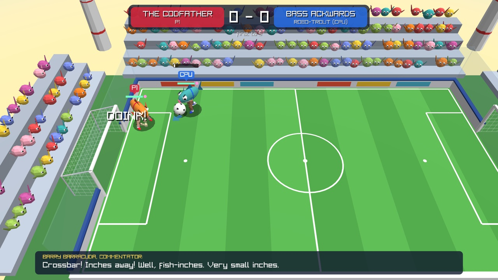
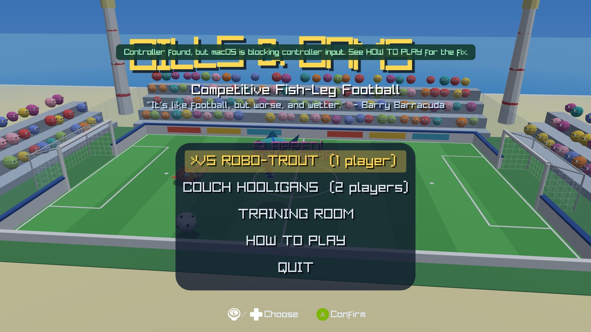
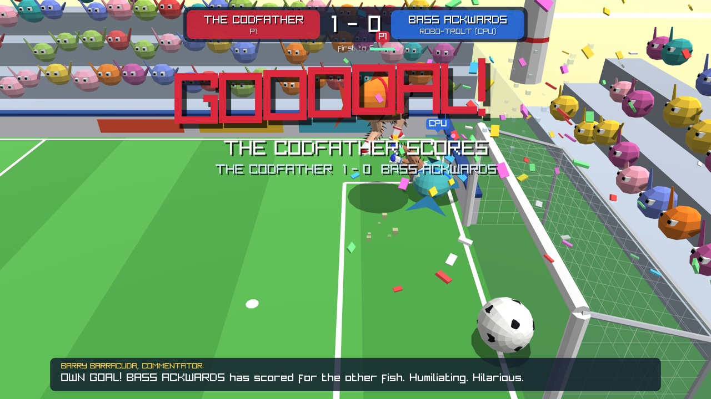
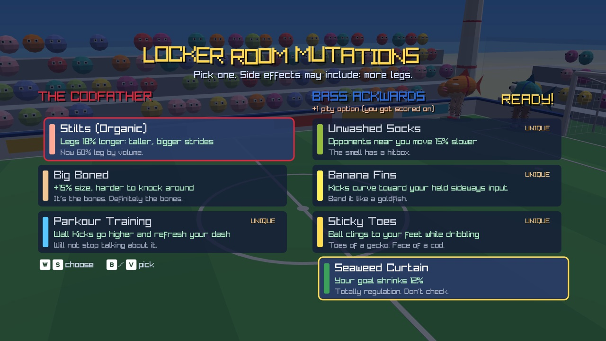
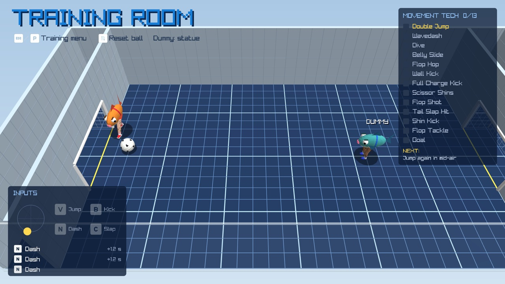

# Gills & Gams

**Competitive Fish-Leg Football.** A 3D 1v1 soccer game where two large fish, standing on hairy human legs, try to kick a ball into a net. It's like football, but worse, and wetter.



The pitch is small on purpose, so matches are about positioning, movement tech and timing rather than chasing the ball. After every goal both fish mutate, so no two matches play the same way.

## Features

- **Two fish, four legs, no dignity.** The Codfather vs. Bass Ackwards, with googly eyes, pectoral-fin arms, lips, striped socks, sneakers and individually rendered leg hairs.
- **Movement tech.** Wavedashes, belly-flop dives, belly slides, Flop Hops, wall kicks, double jumps and overhead Scissor Shins volleys that chain together.
- **Physical combat.** Kick your opponent's shins, flop-tackle them, or spin into a tail slap.
- **Mutations between goals.** Both fish pick one of 19 upgrades after every goal, like *Thunder Thighs*, *Banana Fins* (curving shots), *Unwashed Socks* or *Seaweed Curtain*. The fish that got scored on gets an extra option.
- **1 player vs. ROBO-TROUT** (a CPU opponent), **2-player couch**, or **2v2 School Rumble** for 1-4 players on a slightly bigger pitch, where any player slot without a controller is filled by a CPU.
- **Training Room.** Practise with a live input display, input history with millisecond timings, a 13-move tech checklist, wavedash timing feedback and a practice dummy.
- **Controllers screen**, console style: see which device controls which player, move them between players, and watch live readouts of every button being pressed or held.
- **Controller support** for Xbox, PlayStation and Switch-style pads, with matching button prompts ([Kenney](https://kenney.nl) icons) and hot-plugging. Rumble goes through raylib and isn't supported on macOS yet.
- **Barry Barracuda**, a commentator with 31 years' experience and zero payslips.
- **No asset files for art or sound.** Everything is drawn from raylib primitives and every sound effect is synthesised at startup.

## Screenshots

| | |
|---|---|
|  |  |
| **Title screen**: a CPU match plays in the background | **GOOOOAL!**: slow-mo, confetti, and a commentator who has opinions |
|  |  |
| **Locker Room Mutations**: pick an upgrade after every goal | **Training Room**: grid room, input display and tech checklist |

## Getting the game

### Supported platforms

| Platform | Status |
|---|---|
| macOS, Apple Silicon | Supported and tested. Can be packaged as a `.app`. |
| macOS, Intel | Builds as part of the universal `.app`, not yet tested on Intel hardware. |
| Linux x64 | Packaged as a self-contained tarball, but untested. |
| Windows x64 | Should run with `dotnet run` (raylib ships a native library for it), but untested. No packaged build yet. |

The packaged app targets macOS 12 or later.

### Run from source

You need the [.NET 10 SDK](https://dotnet.microsoft.com/download/dotnet/10.0). [just](https://github.com/casey/just) is optional but handy.

```sh
git clone https://github.com/gridlocdev/gills-and-gams-game.git
cd gills-and-gams-game
dotnet run          # or: just run
```

### Install as a macOS app

```sh
just install-macos    # builds "Gills & Gams.app" and moves it into ~/Applications
just uninstall-macos  # moves it to the Trash again
```

`just build-macos` builds the app into `dist/` without installing it, and `just build-macos-universal` builds one that runs on both Apple Silicon and Intel Macs. The bundle is self-contained, so the Mac running it doesn't need .NET installed.

## How to play

First to **5 goals** wins. After each goal, every fish picks a mutation, then play resumes from kickoff.

### Controls

| Action | Player 1 | Player 2 | Controller |
|---|---|---|---|
| Move | `W` `A` `S` `D` | Arrow keys | Left stick / d-pad |
| Kick (hold to charge) | `B` or `E` | `L` | X / Square, or RT / R2 |
| Jump (press again in mid-air) | `V` or `Space` | `;` | A / Cross |
| Dash (dive when airborne) | `N` or `Left Shift` | `K` | B / Circle, or RB / R1 |
| Tail Slap | `C` or `Q` | `J` | Y / Triangle, or LB / L1 |
| Pause | `Esc` or `P` | | Start / Options |

**With no controllers connected**, the keyboard works like this: WASD (and in VS ROBO-TROUT and the Training Room, the arrow keys too) controls P1.

**With any controller connected**, only controllers play by default: the first controller is P1, the next is P2, and so on. To play on the keyboard alongside controllers, choose **CONTROLLERS** on the title screen and push left/right on the keyboard (`A`/`D` for WASD, `←`/`→` for the arrows) to give it to a player. Push left/right on a controller to move it between players the same way. Your choices stick until you reset them (`R`, or hold Select).
- **Couch 1v1:** a player with nothing assigned falls back to their keyboard layout (WASD for P1, arrows for P2).
- **2v2:** P1 + P2 are red, P3 + P4 are blue, and any player with nothing assigned is played by the CPU.

Holding kick draws an aim arrow on the ground. Tap it for a quick, low pass, or hold until the arrow glows for a lofted, full-power shot.

### Movement tech

| Tech | How |
|---|---|
| **Wavedash** | Dash within 150 ms of landing from a jump. Faster dash, cheaper cooldown. |
| **Dive** | Dash while airborne to belly flop forward. |
| **Belly Slide** | Land a dive. You slide along the grass. |
| **Flop Hop** | Jump during a belly slide to launch with bonus speed. Chain it: jump, dive, hop, dive... |
| **Wall Kick** | Jump while touching a wall in mid-air. Refreshes your air jumps. |
| **Scissor Shins** | Kick in mid-air for an overhead volley. |
| **Flop Shot / Flop Tackle** | Slide or dive belly-first into the ball or the other fish. |
| **Shin Kick** | Kick the other fish when the ball isn't in range. Stuns them. |
| **Tail Slap** | Spin attack: knocks the ball away and flattens anyone nearby. |

The **Training Room** (on the title screen) is the best place to learn these. It ticks off each move as you land it and tells you exactly how many milliseconds you missed a wavedash by.

<details>
<summary><strong>All 19 mutations</strong></summary>

| Mutation | Effect |
|---|---|
| Calf Implants | +12% run speed |
| Extra Leg Hair | +8% run speed, much hairier legs |
| Thunder Thighs | +22% kick power, visibly thicc |
| Spring-Loaded Shins | +18% jump height |
| Bonus Knee | +1 mid-air jump |
| Espresso Gills | Dash cooldown -30% |
| Mucus Coat | Belly slides go further, Flop Hops launch harder |
| Big Boned | +15% size, harder to knock around |
| Sticky Toes | Ball clings to your feet while dribbling *(unique)* |
| Banana Fins | Kicks curve toward your held sideways input *(unique)* |
| Slap Deluxe | Tail Slap: +30% range, +50% stun, faster cooldown |
| Parkour Training | Wall Kicks go higher and refresh your dash *(unique)* |
| Fish Oil | Charge kicks 40% faster |
| Scissor Shins | Mid-air kicks +45% power |
| Unwashed Socks | Opponents near you move 15% slower *(unique)* |
| Seaweed Curtain | Your goal shrinks 12% |
| Cannonball Belly | Dives & slides hit the ball and fish 40% harder |
| Stilts (Organic) | Legs 18% longer: taller, bigger strides |
| Home Waters | +25% speed in your own half *(unique)* |

</details>

### Controllers on macOS

On macOS, Xbox, PlayStation and Switch-style controllers are read through Apple's GameController framework, which needs no special permissions. Pair them in **System Settings → Bluetooth**. If a controller isn't working, run the built-in diagnostics:

```sh
just controllers    # or: dotnet run -- --controllers
```

It shows each controller the game sees, with live stick, trigger and button readouts, and what macOS itself reports, plus a plain-English verdict for each device.

Rumble isn't supported yet for controllers read through the GameController framework (it needs Apple's CoreHaptics). That would make a good first contribution.

## Contributing

Contributions are welcome, especially new mutations, better CPU tactics, commentary lines, controller rumble on macOS, and testing on Windows, Linux and Intel Macs.

### Development setup

- .NET 10 SDK
- [just](https://github.com/casey/just) (optional)
- macOS for building the `.app` (uses `sips`, `iconutil`, `lipo` and `codesign`)

| Recipe | What it does |
|---|---|
| `just run` | Run the game |
| `just build` | Debug build |
| `just controllers` | Live controller diagnostics |
| `just icon` | Re-render the app icon from the in-game fish model |
| `just build-macos` / `just build-macos-universal` | Package `Gills & Gams.app` into `dist/` |
| `just build-linux` | Package a Linux x64 tarball into `dist/` |
| `just run-macos` | Package and launch the app |
| `just install-macos` / `just uninstall-macos` | Install to / remove from `~/Applications` |

### Project layout

| Path | Contents |
|---|---|
| `src/Game.cs` | Match flow, modes and teams, camera, fixed-step simulation |
| `src/Fish.cs` | Fish physics, movement tech, kicking, and rendering (including the legs and hairs) |
| `src/Ball.cs`, `src/Arena.cs` | Ball physics, pitch, goals, crowd and Training Room drawing |
| `src/Upgrades.cs` | Stats and the mutation list (a good first place to contribute) |
| `src/Commentary.cs` | Barry Barracuda's lines |
| `src/Ai.cs` | ROBO-TROUT, the CPU players (with chaser/support roles in 2v2) |
| `src/Training.cs` | Training Room logic and HUD |
| `src/Input.cs`, `src/MacGameController.cs`, `src/Prompts.cs` | Keyboard/controller input, the macOS GameController backend, button prompt icons |
| `src/Roster.cs`, `src/ControllersScreen.cs` | Which device belongs to which player, and the Controllers screen |
| `src/Hud.cs`, `src/Fx.cs`, `src/Audio.cs`, `src/Draw.cs` | UI, particles and popups, synthesised sound, drawing helpers and the lighting shader |
| `src/ControllerCheck.cs`, `src/MacPermissions.cs`, `src/IconRenderer.cs` | Controller diagnostics, macOS permission checks, app icon renderer |
| `scripts/package-mac.sh` | macOS `.app` packaging |
| `assets/input-prompts/` | The Kenney prompt icons the game uses (the full pack is git-ignored) |

### Handy dev tools

- **Screenshot tour:** `FISHLEGS_SHOTS=/some/dir dotnet run` plays a scripted CPU-vs-CPU tour through every screen and saves screenshots (title, how-to, kickoff, gameplay, goal, draft, victory, Training Room). That's how the screenshots in this README were made; they're scaled to 1280px wide JPEGs in `docs/screenshots/`.
- **Controller report:** `dotnet run -- --controllers --report` prints the controller diagnostics to the terminal and exits.
- **App icon:** `dotnet run -- --render-icon assets/icon/AppIcon.png` renders the icon from the real fish model.

### Guidelines

- Work on a branch and keep `main` releasable.
- Use [Conventional Commits](https://www.conventionalcommits.org/) (`feat(training): ...`, `fix(input): ...`, `chore(assets): ...`).
- Match the surrounding code style. Keep the tone silly in player-facing text and clear in code.
- There's no automated test suite yet, so run `dotnet build` and play the part you changed (the Training Room and screenshot tour make this quick). Include a screenshot in the PR for visual changes.
- Art and sound are generated in code. If you add asset files, they must be licensed for redistribution (CC0 preferred), with the license included next to them.

## Credits

- Built with [raylib](https://www.raylib.com) via [Raylib-cs](https://github.com/raylib-cs/raylib-cs).
- Input prompt icons: [Input Prompts](https://kenney.nl/assets/input-prompts) by Kenney (CC0), see `assets/input-prompts/License.txt`.
- Commentary by Barry Barracuda, who has asked us to mention that he is available for weddings.

## License

The game's code is released under the [MIT License](LICENSE). The Kenney input prompt icons in `assets/input-prompts/` are separately licensed CC0.
